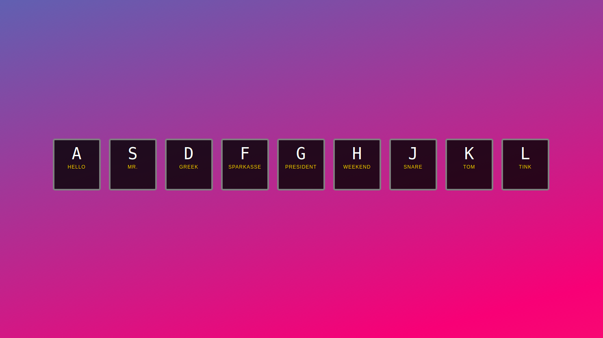

## 

Just doodling with implementing some sounds and stuff on a page. :guitar:

<p align="center"> 

</p>

## Project Info

My take on the ***drum-kit*** from [Wes Bos 30 Days Challange](https://javascript30.com/). Notthing to fancy :smile: 
The ***Favicon*** is embedded in the HTML as ***BASE64***

## Live-Version

See the application live [here](https://sound.web-developer-js.de)

## Local Version

If you have cloned the repository please run:

```
click on the index.html :blink:
```
